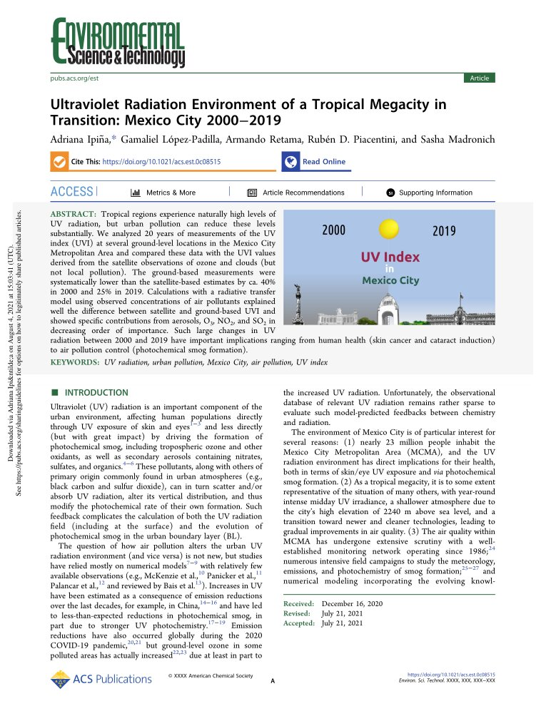

#### Ultraviolet Radiation Environment of a Tropical Megacity in Transition: Mexico City 2000–2019

Repositorio que contiene los algoritmos de análisis de datos de la SEDEMA durante el periodo 2000-2019.

Arículo publicado: 

